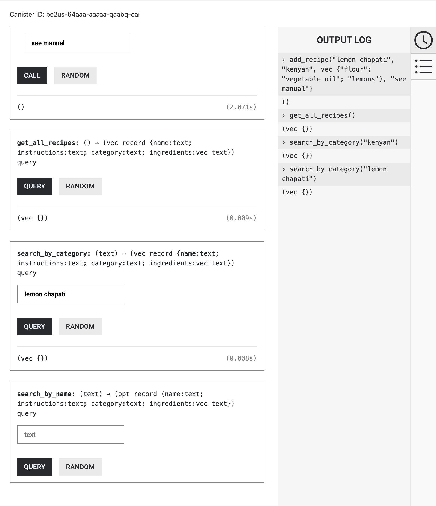

# decentralized_chef

### Requirements

- rustc 1.64 or higher

```bash
$ curl --proto '=https' --tlsv1.2 https://sh.rustup.rs -sSf | sh
$ source "$HOME/.cargo/env"
```

- rust wasm32-unknown-unknown target

```bash
$ rustup target add wasm32-unknown-unknown
```

- candid-extractor

```bash
$ cargo install candid-extractor
```

- install `dfx`

```bash
$ DFX_VERSION=0.15.0 sh -ci "$(curl -fsSL https://sdk.dfinity.org/install.sh)"
$ echo 'export PATH="$PATH:$HOME/bin"' >> "$HOME/.bashrc"
$ source ~/.bashrc
$ dfx start --background
```

If you want to start working on your project right away, you might want to try the following commands:

```bash
$ cd decentralized_chef/
$ dfx help
$ dfx canister --help
```

## Update dependencies

update the `dependencies` block in `/src/{canister_name}/Cargo.toml`:

```
[dependencies]
candid = "0.9.9"
ic-cdk = "0.11.1"
serde = { version = "1", features = ["derive"] }
serde_json = "1.0"
ic-stable-structures = { git = "https://github.com/lwshang/stable-structures.git", branch = "lwshang/update_cdk"}
```

## did autogenerate

Add this script to the root directory of the project:

```
https://github.com/buildwithjuno/juno/blob/main/scripts/did.sh
```

Update line 16 with the name of your canister:

```
https://github.com/buildwithjuno/juno/blob/main/scripts/did.sh#L16
```

After this run this script to generate Candid.
Important note!

You should run this script each time you modify/add/remove exported functions of the canister.
Otherwise, you'll have to modify the candid file manually.

Also, you can add package json with this content:

```
{
    "scripts": {
        "generate": "./did.sh && dfx generate",
        "gen-deploy": "./did.sh && dfx generate && dfx deploy -y"
      }
}
```

and use commands `npm run generate` to generate candid or `npm run gen-deploy` to generate candid and to deploy a canister.

## Running the project locally

If you want to test your project locally, you can use the following commands:

```bash
# Starts the replica, running in the background
$ dfx start --background

# Deploys your canisters to the replica and generates your candid interface
$ dfx deploy
```

# Interacting with decentralized_chef Canister

decentralized_chef is a recipe management system allowing users to add recipes by providing a name, category, ingredients, and instructions. Users can search for recipes either by their names or categories.

## Call Functions

### Query Function

```bash
dfx canister call <canister_id> <function_name>
```

```bash
dfx canister call be2us-64aaa-aaaaa-qaabq-cai search_by_category "Italian"
```

### Update Function

```bash
dfx canister call <canister_id> <update_function_name> arg1 arg2 ...
```

### NOTE!!:

The CLI commands for adding the recipe are still under development, so use the candid ui interface for this functionality, otherwise everty else works smoothly

```bash
dfx canister call be2us-64aaa-aaaaa-qaabq-cai add_recipe "Lasagna" "Italian" '["pasta", "tomato sauce", "cheese"]' "Step-by-step instructions"
```

### Available functions for canister interaction include:

1. get_recipe: Retrieves a recipe by its ID.
1. search_by_category: Searches for recipes based on a specified category.
1. add_recipe: Adds a new recipe to the system.
1. update_recipe: Updates an existing recipe.
1. delete_recipe: Deletes a recipe.

### Call functions issue

At the moment all the query functions are always returning and empty vector despite proper data storage.

